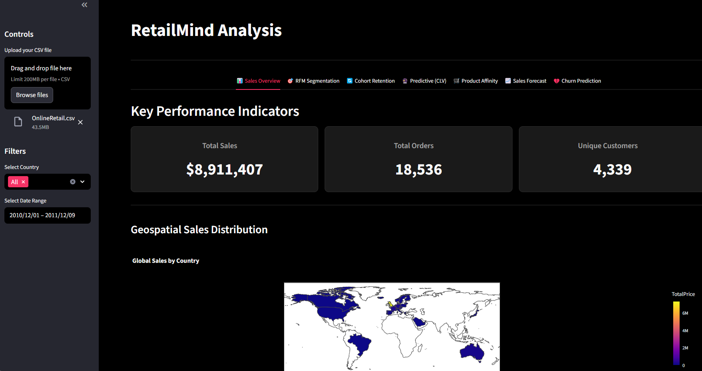
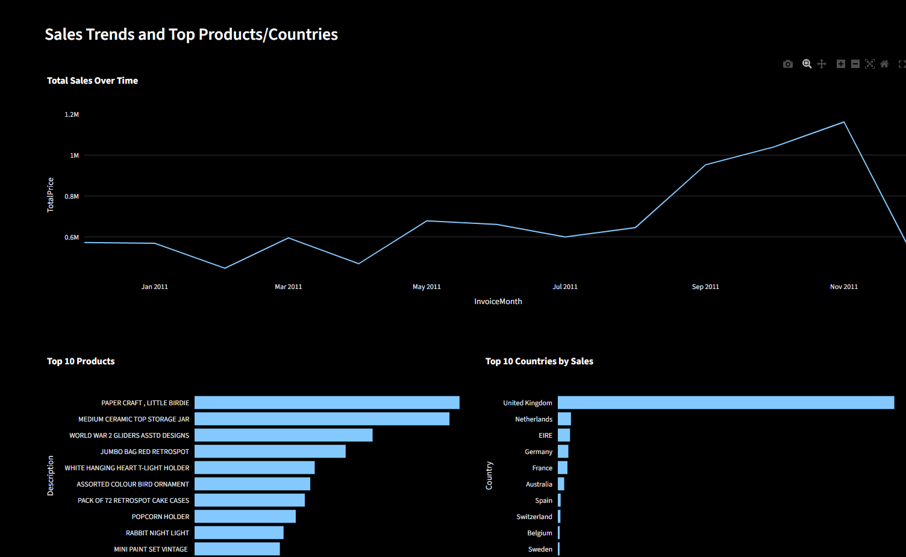

# RetailMind 🔮: Advanced Retail Analytics Dashboard

<p align="center">
  
</p>
<p align="center">
  <em>Dashboard 1: Sales Overview</em>
</p>

<p align="center">
  
</p>
<p align="center">
  <em>Dashboard 2: Customer Analytics</em>
</p>


**RetailMind** is a powerful, interactive web application built with **Streamlit** that provides a comprehensive suite of tools for analyzing retail sales data.  
This dashboard empowers users to move beyond simple sales tracking and uncover deep insights into customer behavior, predict future trends, and make data-driven decisions to boost profitability and customer retention.

From high-level sales overviews to granular, predictive customer analytics, RetailMind transforms raw transactional data into actionable intelligence.

---

## ✨ Features
The dashboard is organized into several analytical tabs, each providing a unique perspective on your data:

- **📊 Sales Overview**  
  Get a bird's-eye view of your business with KPIs like **Total Sales, Total Orders, and Unique Customers**.  
  Visualize sales trends over time and identify top-performing products and countries.

- **🎯 RFM Segmentation**  
  Automatically segment your customers using the **RFM (Recency, Frequency, Monetary)** model.  
  Identify your *Champions*, *Loyal Customers*, and customers who are *At Risk* to tailor marketing strategies.

- **🔄 Cohort Retention Analysis**  
  Visualize customer loyalty with a **retention heatmap**.  
  Understand how well you're retaining customers over time, cohort by cohort.

- **🔮 Predictive CLV (Customer Lifetime Value)**  
  Forecast the future with **BG/NBD and Gamma-Gamma models**.  
  Predict 12-month CLV for each customer to identify and nurture high-value clients.

- **🛒 Product Affinity Analysis**  
  Uncover hidden buying patterns with **Market Basket Analysis**.  
  Discover which products are frequently purchased together to optimize cross-selling.

- **📈 12-Month Sales Forecast**  
  Using a **SARIMA time-series model**, the dashboard projects your sales for the next 12 months with confidence intervals.

- **💔 Churn Prediction**  
  Identify customers likely to churn with a **logistic regression model** and take proactive retention actions.

---

## 📋 Data Requirements
To use this dashboard, you must upload a CSV file containing transactional data with the following columns:

- **InvoiceNo**: Unique identifier for each transaction  
- **StockCode**: Unique identifier for each product  
- **Description**: Product name  
- **Quantity**: Number of items sold per transaction  
- **InvoiceDate**: Date & time of transaction (e.g., `MM/DD/YYYY HH:MM`)  
- **UnitPrice**: Price of a single unit  
- **CustomerID**: Unique identifier for each customer  
- **Country**: Country of purchase  

---

## 🚀 How to Run Locally

1. **Clone the Repository**
   ```arduino
   git clone https://github.com/your-username/RetailMind-Analysis.git
   cd RetailMind-Analysis
   ```
2. **Create a Virtual Environment (Recommended):**
   ```arduiino
   python -m venv .venv
   source .venv/bin/activate
   ```
3. **Install Dependencies**
   ```arduino
   pip install -r requirements.txt
   ```
4. **Run the Streamlit App**
   ```arduino
   streamlit run app.py
   ```

## 🛠️ Key Technologies & Libraries

| Technology / Library | Purpose |
|---------------------|---------|
| **Streamlit**       | Interactive web application framework |
| **Pandas**          | Data manipulation and analysis |
| **Plotly Express**  | Interactive data visualizations |
| **Lifetimes**       | Customer Lifetime Value (CLV) modeling |
| **MLxtend**         | Market Basket Analysis (Association Rules) |
| **Statsmodels**     | Time-series forecasting (SARIMA) |
| **Scikit-learn**    | Churn prediction modeling (Logistic Regression) |
